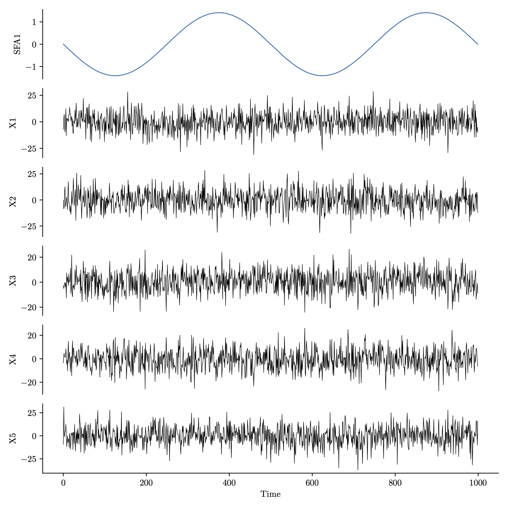

<h1 align="center"><em>tsdr</em>: Time-Series Dimension Reduction</h1>

<p align="center">
    <a href="https://opensource.org/licenses/MIT"></a>
 	  <a href="https://twitter.com/compTimeSeries"></a>
</p>


<p align="center"></p>

## About

Time-series dimension reduction (TSDR) methods are a class of algorithms for the dimension reduction of multivariate data that exploit temporal structure. In contrast to general dimension reduction (GDR) methods, the outputs of which are invariant to temporal permutation, TSDR methods are sensitive to temporal structure.

The figure above visually summarises the categories of TSDR methods that we defined in Owens & Fulcher (2025). The first five categories (a-e) consist of methods that extract time-series components based on different aspects of temporal structure, i.e., slowness, autocorrelation, predictability, determinism, and non-stationarity. The final two categories (f-g) consist of methods that share a common methodology, i.e., diffusion-based and latent variable methods.

The <em>tsdr</em> package provides python implementations of TSDR methods from each of these seven categories. The methods are written in a simple, readable style to enable time-series analysts to better understand a subset of the TSDR methods discussed in the Owens & Fulcher (2025) review paper.

### Acknowledgement :

If you use this software, please read and cite this open-access article:

- &#x1F4D7; Owens & Fulcher [Time-series dimension reduction: a comprehensive review and conceptual unification of algorithms](url), _arXiv_ (In Preparation).


## Installation

Using `pip` for [`tsdr`](https://pypi.org/project/tsdr/):

```
pip install tsdr
```

## Usage

```python
from tsdr.slowness import SFA

import numpy as np
import scipy
import matplotlib.pyplot as plt

# create a dataset for analysis
# a sinusoid
z = np.sin(np.linspace(0, 4*np.pi, 1000))
# multichannel noise
D = 5
noise = np.random.normal(scale=1.0, size=((len(z), D-1)))
# linear mixing
A = scipy.stats.ortho_group.rvs(D, random_state=1)
X = np.concatenate([z.reshape(-1,1), noise], axis=1) @ A

# extract a slow component using SFA
slow_component = SFA(n_components=1).fit_transform(X)

# visualise the component
fig, axs = plt.subplots(6, 1, figsize=(8, 8))
axs[0].plot(slow_component, lw=1.0)
axs[0].set_ylabel('SFA1')
for i in range(D):
    axs[i].spines[['right', 'top', 'bottom']].set_visible(False)
    axs[i].set_xticks([])
    axs[i+1].plot(X[:, i], c='black', linewidth=0.5)
    axs[i+1].set_ylabel(f'X{i+1}')
axs[D].spines[['right', 'top']].set_visible(False)
axs[D].set_xlabel('Time')
plt.tight_layout()

```

<p align="center"></p>

## Available methods

```python
from tsdr.slowness import SFA, BioSFA
from tsdr.autocorrelation import TICA, TMCA, CSA, TCCA_Stiefel, sPCA_dwt
from tsdr.predictability import TLPC, PrCA, DiCCA
from tsdr.determinism import DyCA, DMD
from tsdr.nonstationarity import ASSA, SSAsir, SSAsave, SSAcor, WaSSAf, WaSSAr, BSSnonstat
from tsdr.diffusion import DMcov, DIG
from tsdr.latentvariable import LDS
```

<!-- ## Usage notes
-
-
-->

